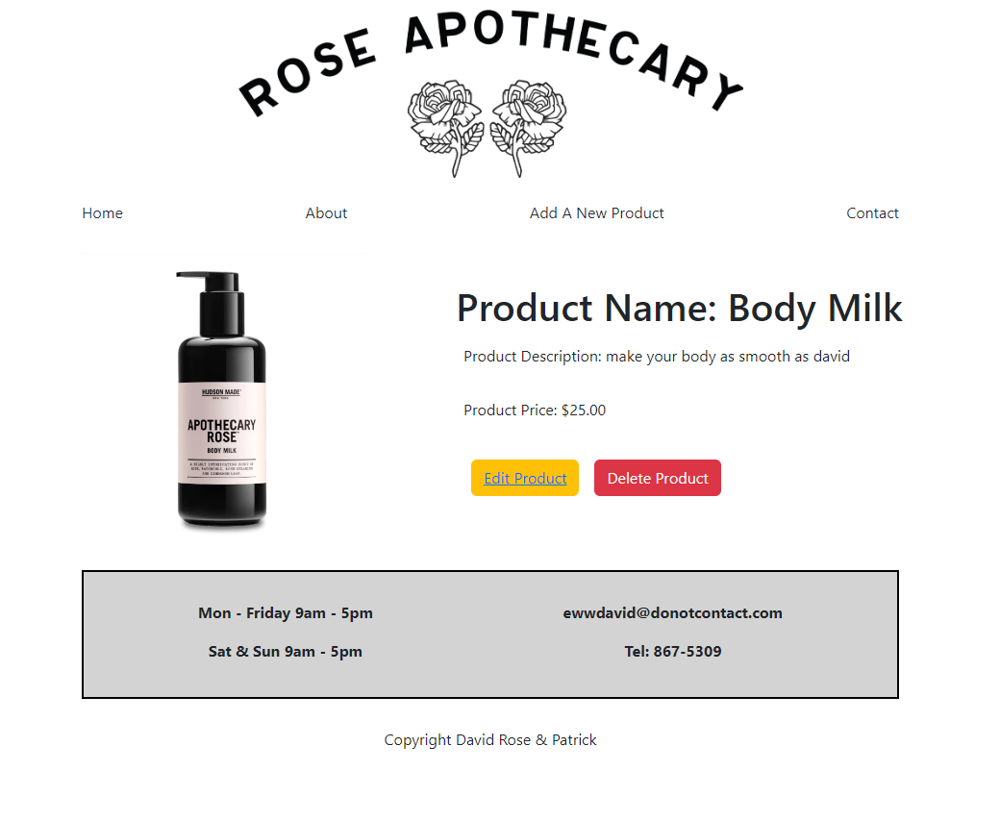

<h2>Rose Apothecary Store</h2>

In this project I created a rose apothecary e-commerce store based on the TV show Schitts Creek. I used react framework along with express and node for the backend and MongoDB as my database. This allowed users to create, edit, update, and delete products. Users are also able to view individual products being sold in the store

